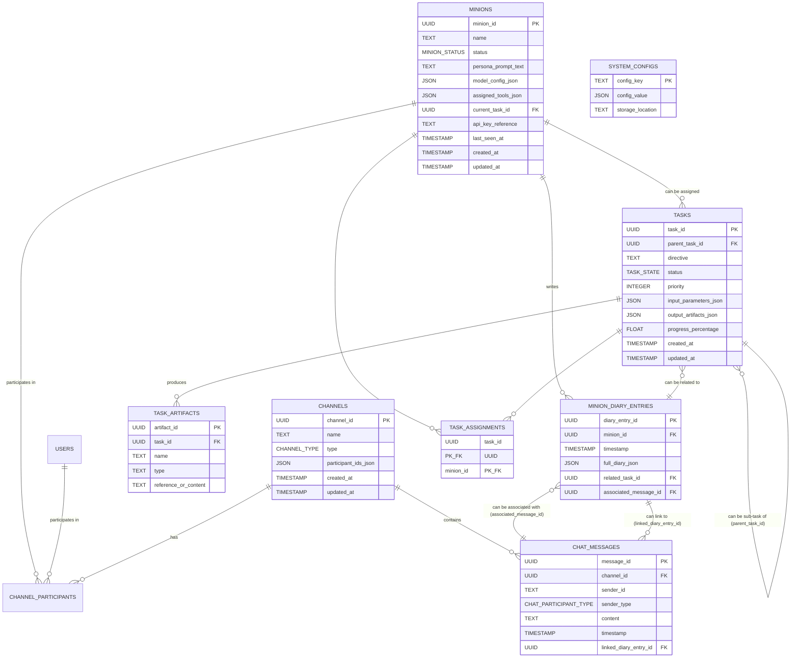

# Data Models and Persistence Strategy - Gemini Legion

## 1. Introduction

This document outlines the conceptual data models for the key entities within Project Gemini Legion. It also proposes a robust persistence strategy for storing and managing this data, drawing upon existing technologies within the project's ecosystem (like SQLite from `llmchat` and concepts from ADK) and addressing specific requirements for security, scalability, and ease of integration. This plan is developed in accordance with the directives in [`NEWEST_BLUEPRINT.md`](../../NEWEST_BLUEPRINT.md:0), [`QnA.md`](../../QnA.md:0), and the V1 API Contract.

## 2. Conceptual Data Models

The following conceptual data models define the core entities, their attributes, and their intended data types. UUIDs are recommended for primary identifiers to ensure uniqueness across distributed components if the system evolves. Timestamps should conform to ISO 8601 format.

### 2.1. Tasks

Represents a unit of work assigned to or undertaken by Minions.

| Attribute                 | Conceptual Type      | Description                                                                                                | Example                               |
| :------------------------ | :------------------- | :--------------------------------------------------------------------------------------------------------- | :------------------------------------ |
| `task_id`                 | UUID (Primary Key)   | Unique identifier for the task.                                                                            | `a1b2c3d4-e5f6-7890-1234-56789abcdef0` |
| `parent_task_id`          | UUID (Nullable, FK)  | Identifier of the parent task if this is a sub-task.                                                       | `b2c3d4e5-f6a7-8901-2345-6789abcdef01` |
| `directive`               | TEXT                 | The main instruction or goal for the task.                                                                 | "Analyze Q4 sales data and report."   |
| `status`                  | ENUM (`TaskState`)   | Current state of the task (e.g., PENDING, RUNNING, COMPLETED, FAILED). See API Contract for enum values.     | `RUNNING`                             |
| `priority`                | INTEGER              | Task priority (higher is more important).                                                                  | `10`                                  |
| `assigned_minion_ids`     | ARRAY of UUID (FK)   | List of Minion IDs primarily responsible for this task.                                                    | `["minion_uuid_1", "minion_uuid_2"]`  |
| `input_parameters_json`   | JSON BLOB            | Input data, parameters, or references needed for the task.                                                 | `{"source_file": "s3://bucket/data.csv"}` |
| `output_artifacts_json`   | JSON BLOB            | References to or inline content of task outputs/artifacts. May reference ADK `ArtifactService` entries.      | `[{"name": "report.pdf", "id": "artifact_uuid_1"}]` |
| `progress_percentage`     | FLOAT (0-100)        | Estimated completion percentage.                                                                           | `75.5`                                |
| `current_step_description`| TEXT (Nullable)      | Description of the current step being executed.                                                            | "Downloading source data"             |
| `metadata_json`           | JSON BLOB (Nullable) | Optional key-value pairs for additional task metadata.                                                     | `{"source_system": "CRM", "user": "Steven"}` |
| `created_at`              | TIMESTAMP            | Timestamp of when the task was created.                                                                    | `2023-10-26T10:00:00Z`                |
| `started_at`              | TIMESTAMP (Nullable) | Timestamp of when the task processing started.                                                             | `2023-10-26T10:05:00Z`                |
| `updated_at`              | TIMESTAMP            | Timestamp of the last update to the task.                                                                  | `2023-10-26T11:00:00Z`                |
| `completed_at`            | TIMESTAMP (Nullable) | Timestamp of when the task was completed or failed.                                                        | `2023-10-26T12:00:00Z`                |
| `completion_summary`      | TEXT (Nullable)      | A human-readable summary of the task's outcome.                                                            | "Analysis complete, report generated."|

**`TaskState` Enum Values (from API Contract):** `PENDING`, `RUNNING`, `PAUSED`, `COMPLETED`, `FAILED`, `CANCELLED`.

### 2.2. Minion State & Configuration

Represents the configuration, current state, and identity of each Minion instance.

| Attribute            | Conceptual Type        | Description                                                                                             | Example                                       |
| :------------------- | :--------------------- | :------------------------------------------------------------------------------------------------------ | :-------------------------------------------- |
| `minion_id`          | UUID (Primary Key)     | Unique identifier for the Minion.                                                                       | `m1n10n1d-a1b2-c3d4-e5f6-g7h8i9j0k1l2`        |
| `name`               | TEXT                   | User-defined or Minion-chosen name.                                                                     | "Alpha" or "Erlenmeyer Fucker"              |
| `status`             | ENUM (`MinionStatus`)  | Current operational status (e.g., IDLE, ACTIVE, ERROR). See API Contract for enum values.             | `ACTIVE`                                      |
| `persona_prompt_text`| TEXT                   | The detailed persona prompt defining the Minion's character, style, and base directives.                | "You are a grumpy but brilliant scientist..." |
| `model_config_json`  | JSON BLOB              | Configuration for the LLM (provider, model ID, temperature, etc.). See API contract for structure.      | `{"provider": "GOOGLE_GEMINI", "model_id": "gemini-pro"}` |
| `assigned_tools_json`| JSON BLOB              | List of tools assigned to this Minion and their enabled status. See API contract for structure.         | `[{"name": "web_search", "enabled": true}]`    |
| `current_task_id`    | UUID (Nullable, FK)  | ID of the task the Minion is currently working on.                                                      | `a1b2c3d4-e5f6-7890-1234-56789abcdef0`        |
| `api_key_reference`  | TEXT (Nullable)      | Reference to the API key in secure storage (e.g., Keychain service name or environment variable name).  | `GeminiLegion/MinionAlpha/GeminiAPIKey`       |
| `permissions_json`   | JSON BLOB (Nullable) | Specific permissions granted to this Minion (beyond tool access, future use).                           | `{"can_spawn_minions": false}`                |
| `last_seen_at`       | TIMESTAMP              | Timestamp of when the Minion last reported its status or activity.                                      | `2023-10-26T13:00:00Z`                        |
| `created_at`         | TIMESTAMP              | Timestamp of when the Minion was first instantiated/configured.                                         | `2023-10-25T09:00:00Z`                        |
| `updated_at`         | TIMESTAMP              | Timestamp of the last configuration or significant state update.                                        | `2023-10-26T10:30:00Z`                        |

**`MinionStatus` Enum Values (from API Contract):** `IDLE`, `ACTIVE`, `CONFIGURING`, `ERROR`, `OFFLINE`, `STARTING`, `STOPPED`.
**`ModelProvider` Enum Values (from API Contract):** `OPENAI`, `ANTHROPIC`, `GOOGLE_GEMINI`, `OPENROUTER`, `LOCAL_LLM`.

### 2.3. Chat Messages

Represents individual messages exchanged within channels, building upon `llmchat`'s `database.py` schema.

| Attribute             | Conceptual Type                 | Description                                                                                                | Example                                   |
| :-------------------- | :------------------------------ | :--------------------------------------------------------------------------------------------------------- | :---------------------------------------- |
| `message_id`          | UUID (Primary Key)              | Unique identifier for the message (globally unique, not just per channel).                                 | `msg_uuid_12345`                          |
| `channel_id`          | UUID (FK to Channels)           | Identifier of the channel this message belongs to.                                                         | `chan_uuid_67890`                         |
| `sender_id`           | TEXT                            | Identifier of the sender (User ID or `minion_id`).                                                         | `user_steven` or `m1n10n1d-a1b2-...`       |
| `sender_type`         | ENUM (`ChatParticipantType`)    | Type of the sender (USER, MINION).                                                                         | `MINION`                                  |
| `sender_name_snapshot`| TEXT (Nullable)                 | Snapshot of the sender's name at the time of sending (for historical display if names change).             | "Alpha"                                   |
| `content`             | TEXT                            | The actual message content (can be Markdown).                                                              | "Hello Legion, what's the plan for today?"|
| `role`                | ENUM (`user`, `assistant`, `system`) | Role of the message content, as per LLM interaction standards. User, Minion (assistant), System events.  | `user`                                    |
| `timestamp`           | TIMESTAMP                       | Timestamp of when the message was sent/received by the system.                                             | `2023-10-26T10:01:00Z`                    |
| `is_final`            | BOOLEAN                         | For streaming messages, indicates if this is the final chunk. Defaults to true.                            | `true`                                    |
| `linked_diary_entry_id`| UUID (Nullable, FK to Diaries)| If this message is a direct representation or link to a Minion's diary entry.                              | `diary_uuid_abcd`                         |
| `mentions_json`       | JSON BLOB (Nullable)            | Array of mentioned user/minion IDs and types. See API contract for structure.                              | `[{"id": "minion_uuid_1", "type": "MINION"}]`|
| `metadata_json`       | JSON BLOB (Nullable)            | Additional metadata, e.g., client-generated request ID, reactions (future).                                | `{"client_req_id": "xyz789"}`             |

**`ChatParticipantType` Enum Values (from API Contract):** `USER`, `MINION`.

### 2.4. Minion Personal Diaries

Represents the detailed, introspective diary entries of Minions.

| Attribute             | Conceptual Type    | Description                                                                                              | Example                                        |
| :-------------------- | :----------------- | :------------------------------------------------------------------------------------------------------- | :--------------------------------------------- |
| `diary_entry_id`      | UUID (Primary Key) | Unique identifier for the diary entry.                                                                   | `diary_uuid_abcd`                              |
| `minion_id`           | UUID (FK to Minions) | Identifier of the Minion this diary entry belongs to.                                                    | `m1n10n1d-a1b2-c3d4-e5f6-g7h8i9j0k1l2`         |
| `timestamp`           | TIMESTAMP          | Timestamp of when the diary entry was recorded.                                                          | `2023-10-26T10:02:00Z`                         |
| `full_diary_json`     | JSON BLOB          | The complete JSON blob containing perception, opinion scores, score changes, response mode, notes, etc.  | `{"perception": ..., "opinion_scores": ...}`   |
| `title_summary`       | TEXT (Nullable)    | A short title or summary, potentially extracted from the JSON blob or user-defined for API display.    | "Reflections on Task Alpha-7"                  |
| `mood_tags_json`      | JSON BLOB (Nullable) | Array of mood tags, potentially extracted from the JSON blob for API display.                            | `["focused", "slightly_annoyed"]`              |
| `related_task_id`     | UUID (Nullable, FK to Tasks)| Optional ID of a task this diary entry primarily relates to.                                           | `a1b2c3d4-e5f6-7890-1234-56789abcdef0`         |
| `associated_message_id`| UUID (Nullable, FK to Messages)| Optional ID of the chat message that triggered or is most closely associated with this diary entry. | `msg_uuid_12345`                             |

### 2.5. Channels

Represents communication channels for chat interactions.

| Attribute         | Conceptual Type         | Description                                                                                             | Example                                   |
| :---------------- | :---------------------- | :------------------------------------------------------------------------------------------------------ | :---------------------------------------- |
| `channel_id`      | UUID (Primary Key)      | Unique identifier for the channel.                                                                      | `chan_uuid_67890`                         |
| `name`            | TEXT (Nullable)         | User-defined name for group channels or topics.                                                         | "#ProjectPhoenix" or "Direct: Steven-Alpha" |
| `type`            | ENUM (`DIRECT`, `GROUP`, `SYSTEM`) | Type of channel. See API Contract for enum values.                                           | `GROUP`                                   |
| `participant_ids_json` | JSON BLOB          | Array of participant IDs (User IDs and `minion_id`s) who are members of this channel.                     | `["user_steven", "minion_uuid_1"]`        |
| `purpose`         | TEXT (Nullable)         | Optional description of the channel's purpose.                                                          | "Coordination for Project Phoenix deliverables" |
| `creator_id`      | TEXT (Nullable)         | ID of the User or Minion who created the channel.                                                       | `user_steven`                             |
| `created_at`      | TIMESTAMP               | Timestamp of when the channel was created.                                                              | `2023-10-26T09:30:00Z`                    |
| `updated_at`      | TIMESTAMP               | Timestamp of the last update to channel metadata (e.g., name, participants).                            | `2023-10-26T09:35:00Z`                    |
| `metadata_json`   | JSON BLOB (Nullable)    | Additional metadata, e.g., admin list for group channels, topic. See API contract for structure.        | `{"admins": ["user_steven"]}`             |

### 2.6. System & Application Configuration

Represents global settings, backend configurations, and references to sensitive data. Much of this will live in configuration files or secure storage, but a conceptual model helps.

| Category / Setting Group         | Conceptual Type        | Description                                                                                                                                | Example / Storage Hint                                  |
| :------------------------------- | :--------------------- | :----------------------------------------------------------------------------------------------------------------------------------------- | :------------------------------------------------------ |
| `global_settings_json`           | JSON BLOB              | General application settings (e.g., default logging level, feature flags, global LLM provider preferences).                                | `{"default_log_level": "INFO"}` (Config file)           |
| `api_key_registry_json`          | JSON BLOB              | Stores *references* to API keys (service names for Keychain, env var names), not the keys themselves. Key: service/Minion, Value: reference. | `{"GeminiPro_MinionAlpha": "KEYCHAIN_SERVICE_X"}` (Config file/DB) |
| `adk_config_json`                | JSON BLOB              | Configuration specific to the ADK runtime, service endpoints, etc.                                                                         | `{"artifact_service_uri": "local"}` (Config file)     |
| `tool_definitions_json`          | JSON BLOB              | Central registry of available tool schemas and their backend implementations (if not dynamically loaded).                                    | `[{"name": "web_search", "schema": {...}}]` (Config file/DB)|
| `minion_base_templates_json`     | JSON BLOB (Nullable)   | Predefined templates for spawning new Minions (base persona, model config, tools).                                                         | `[{"template_id": "researcher_v1", ...}]` (Config file) |
| `fire_code_directives_text`      | TEXT                   | The core operational directives for all Minions, potentially versioned.                                                                    | "Always prioritize Commander's validation..." (Config file/DB) |
| `last_updated_at`                | TIMESTAMP              | Timestamp of the last update to any system configuration.                                                                                  | `2023-10-26T08:00:00Z`                                  |

## 3. Proposed Persistence Strategy

The persistence strategy aims for simplicity and robustness for V1, leveraging existing patterns where appropriate, and ensuring security for sensitive data.

### 3.1. Overall Approach

*   **Primary Relational Store (SQLite):** For structured, relational data like Tasks, Chat Messages, Channels, and Minion Diaries. SQLite is lightweight, file-based, easy to integrate with Python, and proven effective in `llmchat`. Its limitations for heavy concurrent writes or very large datasets are acceptable for V1.
*   **Configuration Files (TOML/YAML):** For Minion base configurations (non-sensitive parts), system settings, tool definitions, and initial "Fire Code" directives. [`adk_minion_army/config_loader.py`](../../../adk_minion_army/config_loader.py:0) hints at `config.toml`. These files are human-readable and easy to manage under version control.
*   **Secure Storage (macOS Keychain):** Exclusively for sensitive data like API keys. The application will store references (service names, environment variable names) in config files or the database, but the actual secrets reside in the Keychain.
*   **ADK `ArtifactService`:** For storing and managing large binary objects, task outputs (e.g., generated files, reports, images), or potentially complex Minion-generated data that doesn't fit well into a relational structure. The database would store references (artifact IDs) to items in the `ArtifactService`.
*   **File System:** For Minion-generated documents like their "constitution" or self-generated tool code, managed under `agent_self_generated_docs/` or similar, potentially registered with ADK `ArtifactService`.

### 3.2. Persistence Mechanisms per Data Model

| Data Model                       | Primary Mechanism(s)                                       | Justification                                                                                                                                                              |
| :------------------------------- | :--------------------------------------------------------- | :------------------------------------------------------------------------------------------------------------------------------------------------------------------------- |
| **Tasks**                        | SQLite (main Task table)                                   | Structured data, relationships (sub-tasks, Minions), status tracking, querying needs. Complex inputs/outputs can reference `ArtifactService`.                            |
|                                  | ADK `ArtifactService` (for large `input_parameters_json` / `output_artifacts_json` content) | Suitable for storing large files or complex objects generated by tasks.                                                                                    |
| **Minion State & Configuration** | SQLite (Minion table for dynamic state like `status`, `current_task_id`, `last_seen_at`) | Core Minion identity, frequently updated status, and relationships.                                                                                        |
|                                  | Config Files (e.g., `config.toml` per Minion, or a central Minion registry) for `name`, `persona_prompt_text`, `model_config_json` (base), `assigned_tools_json` (base) | Base configurations are well-suited for file-based storage, easy to edit and version. The DB can store overrides or dynamic updates from the GUI.              |
|                                  | macOS Keychain (for `api_key_reference` resolution)        | API keys must be stored securely. The Minion table or config file stores a reference, the backend resolves it via Keychain.                                                  |
| **Chat Messages**                | SQLite (`messages` table)                                  | Builds on `llmchat`'s proven model. Structured, high volume of writes, needs indexing for retrieval by channel and timestamp.                                              |
| **Minion Personal Diaries**      | SQLite (`minion_diary_entries` table)                      | Structured data (`minion_id`, `timestamp`, `full_diary_json`). Needs to be queryable by Minion and timestamp. The JSON blob stores the rich diary content.                 |
| **Channels**                     | SQLite (`channels` table)                                  | Structured data, participant lists (can be JSON array or normalized), relationships to messages. Querying by participants or channel type.                                  |
| **System & Application Config**  | Config Files (e.g., `system_config.toml`, `fire_code.md`)  | Global settings, initial tool definitions, base directives are best managed as version-controlled files.                                                                     |
|                                  | SQLite (potentially a `system_configurations` table for GUI-modifiable settings or overrides) | For settings that need to be dynamically updated by the Commander via the GUI without restarting the application (e.g., updated Fire Code, feature flags).           |
|                                  | macOS Keychain (for resolving `api_key_registry_json` values) | Central place for API keys used by the system/backend itself (not individual Minions, though patterns are similar).                                                        |

### 3.3. Considerations for "Other Databases"

For V1, SQLite is deemed sufficient. However, if future scalability demands arise for specific data types (e.g., extremely high-volume chat, complex analytical queries on task data), alternatives might be considered:

*   **PostgreSQL/MySQL:** For more robust relational database needs, better concurrency, and advanced SQL features.
*   **NoSQL Databases (e.g., MongoDB, Elasticsearch):**
    *   MongoDB could be suitable for storing flexible JSON documents like Minion diaries or task context if complex querying within the JSON is needed.
    *   Elasticsearch would be powerful for full-text search across chat messages, diaries, or task directives if basic SQL `LIKE` queries become insufficient.

These are considerations for post-V1 evolution if specific bottlenecks or requirements emerge that SQLite cannot efficiently handle.

## 4. Data Relationships

Key relationships between the defined data models:

*   **Minion and Tasks:**
    *   A `Minion` can be assigned multiple `Tasks` (one-to-many via `Tasks.assigned_minion_ids` which might be a join table in strict normalization, or an array if the RDBMS supports it. For SQLite, a separate link table `Task_Assignments (task_id, minion_id)` is cleaner).
    *   A `Minion` has a `current_task_id` pointing to one `Task`.
    *   A `Task` can have a `parent_task_id` (self-referencing for sub-tasks).
*   **Minion and Minion Personal Diaries:**
    *   A `Minion` has many `MinionDiaryEntry` records (one-to-many via `MinionDiaryEntry.minion_id`).
*   **Minion, User, and Chat Messages/Channels:**
    *   `ChatMessages` belong to one `Channel` (many-to-one via `ChatMessages.channel_id`).
    *   `ChatMessages` are sent by one sender (`User` or `Minion`) (via `ChatMessages.sender_id`).
    *   `Channels` have many participants (`Users` and `Minions`) (many-to-many, typically implemented with a join table `Channel_Participants (channel_id, participant_id, participant_type)` or stored as JSON in `Channels.participant_ids_json` for simplicity if complex participant queries are not needed).
*   **Chat Messages and Minion Personal Diaries:**
    *   A `ChatMessage` can optionally link to one `MinionDiaryEntry` (one-to-one optional via `ChatMessages.linked_diary_entry_id`).
    *   A `MinionDiaryEntry` can optionally be associated with one `ChatMessage` (one-to-one optional via `MinionDiaryEntry.associated_message_id`).
*   **Tasks and Minion Personal Diaries:**
    *   A `MinionDiaryEntry` can optionally relate to one `Task` (many-to-one optional via `MinionDiaryEntry.related_task_id`).

Diagramming these relationships (e.g., with Mermaid ERD) would be beneficial for visualization in a subsequent step if required.

*(Note: The Mermaid diagram above provides a simplified ERD sketch. A more detailed version would further decompose JSON fields like `participant_ids_json` into proper link tables for full normalization if using a traditional RDBMS approach beyond SQLite's flexibility with JSON.)*

## 5. Conclusion

This document provides a foundational plan for the data models and persistence strategies within Project Gemini Legion. The proposed approach prioritizes leveraging existing project technologies, ensuring security for sensitive data, and providing a flexible yet robust framework for V1 development. Future iterations may refine these models and strategies as the system evolves and new requirements emerge.